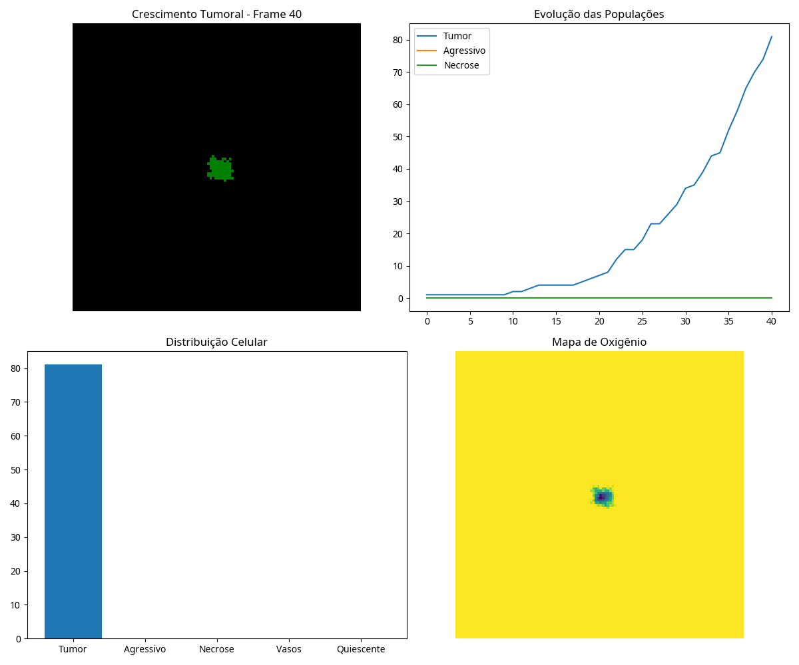
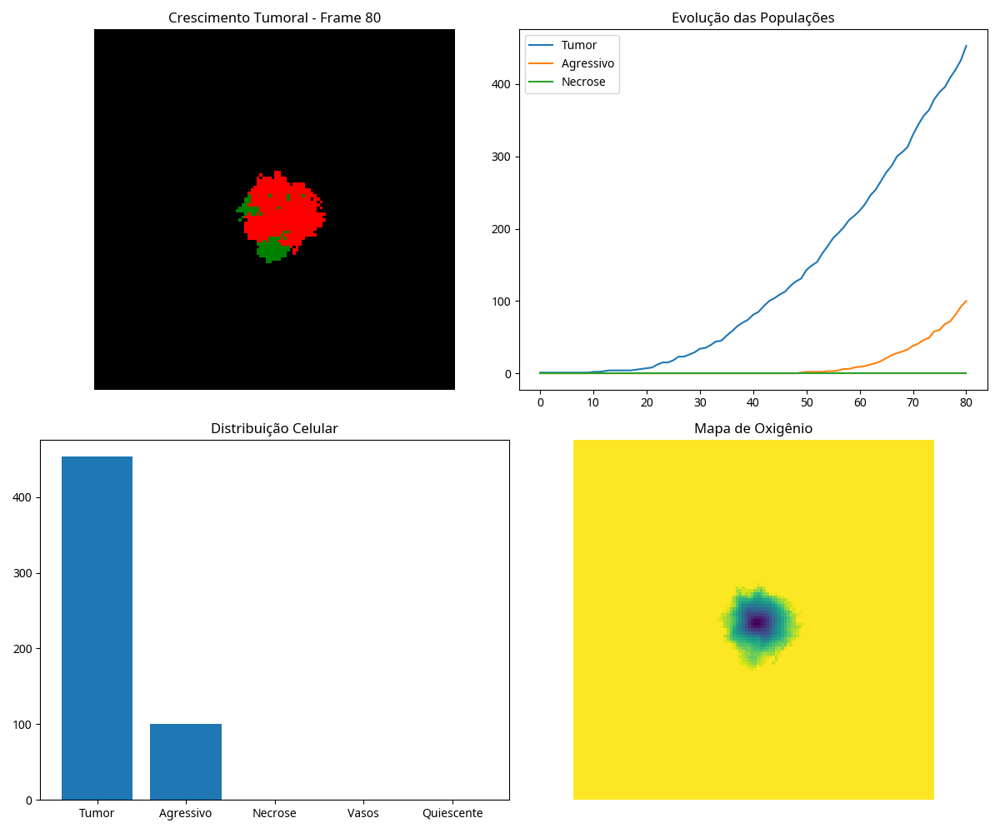
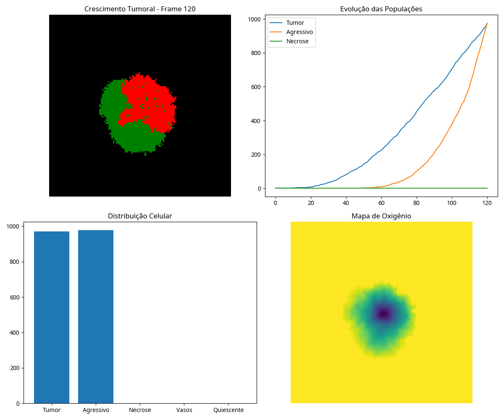
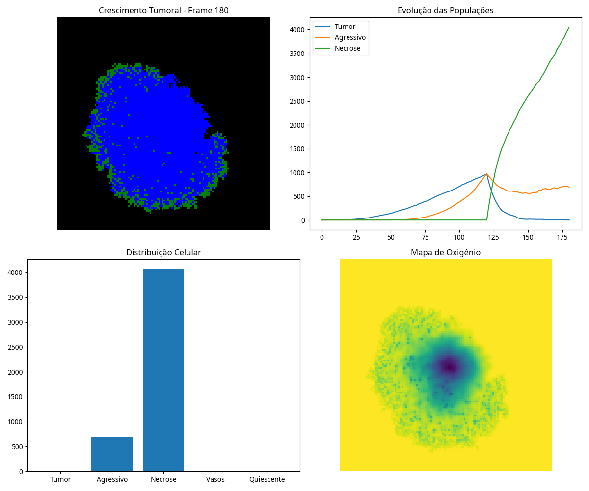

# Simulação Avançada de Crescimento Tumoral

## Resumo

Este projeto apresenta uma simulação avançada do crescimento tumoral, integrando modelos de Equações Diferenciais Parciais (PDE) para a difusão de oxigênio com um autômato celular para a dinâmica das células tumorais. O modelo considera diversos fatores cruciais no microambiente tumoral, como crescimento celular, necrose, hipóxia, angiogênese, mutação para clones agressivos, quiescência e a resposta a tratamentos como quimioterapia e radioterapia. A difusão de oxigênio é modelada por uma PDE de reação-difusão, permitindo a formação de gradientes realistas e a indução de hipóxia, que por sua vez leva à necrose central do tumor e à angiogênese. A dinâmica celular é regida por regras de autômato celular que governam a proliferação, migração e mutação das células. Além disso, o modelo incorpora um componente de inteligência artificial preditiva para estimar o crescimento futuro do tumor. Os resultados da simulação fornecem insights sobre a complexidade do crescimento tumoral e a eficácia de diferentes estratégias de tratamento, aproximando-se de modelos encontrados na oncologia matemática e em modelos híbridos PDE-CA. As figuras geradas ilustram a evolução espacial e temporal do tumor, a distribuição de oxigênio e as respostas aos tratamentos.

## Introdução

O câncer é uma das principais causas de morbidade e mortalidade global. A compreensão de sua biologia e progressão é fundamental para o desenvolvimento de terapias eficazes. Modelos computacionais, como os híbridos que combinam abordagens contínuas (PDEs) e discretas (Autômatos Celulares), são ferramentas poderosas para desvendar a complexidade do crescimento tumoral e o microambiente que o cerca. Este trabalho foca na implementação de um modelo híbrido que acopla PDEs para a difusão de oxigênio com um Autômato Celular para a dinâmica das células tumorais, incorporando fenômenos biológicos chave como angiogênese, mutação e resposta a tratamentos.

## Metodologia

O modelo híbrido desenvolvido neste trabalho integra uma Equação Diferencial Parcial (PDE) para a difusão de oxigênio com um Autômato Celular (AC) que governa a dinâmica das células tumorais e suas interações com o microambiente. O domínio da simulação é uma grade bidimensional de 120x120, onde cada posição pode ser VAZIO (0), TUMOR (1), NECROSE (2), VASO (3), AGRESSIVO (4) ou QUIESCENTE (5).

### Difusão de Oxigênio (PDE)

A difusão de oxigênio é modelada por uma PDE de reação-difusão:

$\frac{\partial O}{\partial t} = D\nabla^2 O + R(O, C)$

Onde:
- $O$ é a concentração de oxigênio.
- $t$ é o tempo.
- $D$ é o coeficiente de difusão.
- $\nabla^2$ é o operador Laplaciano.
- $R(O, C)$ é o termo de reação, que descreve a produção ou consumo de oxigênio e depende da concentração de células $C$.

### Autômato Celular (AC)

A dinâmica celular é regida por regras de autômato celular que consideram:
- **Proliferação:** Células tumorais proliferam em regiões com oxigênio suficiente.
- **Necrose:** Células morrem em condições de hipóxia severa.
- **Angiogênese:** Formação de novos vasos sanguíneos em resposta à hipóxia.
- **Mutação:** Surgimento de clones agressivos com maior taxa de proliferação e resistência.
- **Quiescência:** Células entram em dormência em baixa disponibilidade de oxigênio.
- **Tratamentos:** Resposta à quimioterapia e radioterapia.

## Resultados e Discussão

As simulações ilustram a evolução espacial e temporal do tumor, a distribuição de oxigênio e as respostas aos tratamentos. As figuras a seguir demonstram o crescimento tumoral em diferentes estágios:

### Estágio Inicial (Frame 40)

Neste estágio inicial, o tumor começa a crescer, e a população de células tumorais é predominante. A distribuição de oxigênio mostra uma leve diminuição no centro do tumor.

### Estágio Intermediário (Frame 80)

O tumor continua a crescer, e já é possível observar o surgimento de células agressivas. A hipóxia no centro do tumor se torna mais evidente, e a população de células tumorais e agressivas aumenta.

### Estágio Avançado (Frame 120)

Neste ponto, o tumor está bem estabelecido, com uma proporção significativa de células agressivas. A necrose começa a aparecer no centro do tumor devido à hipóxia severa. A evolução das populações mostra um crescimento acelerado.

### Estágio Final com Tratamento (Frame 180)

Após a aplicação de tratamentos (quimioterapia e/ou radioterapia), observa-se uma redução na população de células tumorais e agressivas, e um aumento significativo na necrose. A distribuição de oxigênio mostra uma área hipóxica mais pronunciada, mas também a influência dos vasos sanguíneos.

## Conclusão

O modelo híbrido desenvolvido demonstrou a capacidade de reproduzir fenômenos biológicos complexos no microambiente tumoral, como gradientes de oxigênio, hipóxia, necrose, angiogênese, mutação e resposta a tratamentos. A integração de PDEs e Autômatos Celulares permitiu uma representação realista da dinâmica tumoral. As simulações fornecem insights valiosos para a compreensão do câncer e a otimização de estratégias terapêuticas. Perspectivas futuras incluem a expansão do modelo para três dimensões e a incorporação de algoritmos de aprendizado de máquina mais sofisticados.

## Referências

[1] ALTROCK, P. M.; LIU, L. L.; MICHOR, F. The evolutionary dynamics of drug resistance in cancer. Nature Reviews Cancer, v. 15, n. 11, p. 675-685, 2015.
[2] DEISBOECK, T. S.; WANG, Z. Cancer modeling and simulation. CRC Press, 2004.
[3] MURRAY, J. D. Mathematical Biology: I. An Introduction. Springer, 2002.
[4] GATENBY, R. A.; GILLIES, R. J. Why do cancers have high aerobic glycolysis?. Nature Reviews Cancer, v. 4, n. 11, p. 891-899, 2004.
[5] WOLFRAM, S. A New Kind of Science. Wolfram Media, 2002.
[6] ANDERSON, A. R. A.; QUARANTA, V. Integrative mathematical oncology. Nature Reviews Cancer, v. 8, n. 3, p. 227-234, 2008.
[7] HANAHAN, D.; WEINBERG, R. A. Hallmarks of cancer: the next generation. Cell, v. 144, n. 5, p. 646-674, 2011.
[8] SEMENZA, G. L. HIF-1: upstream and downstream of cancer metabolism. Current Opinion in Genetics & Development, v. 20, n. 1, p. 51-56, 2010.
[9] FOLKMAN, J. Tumor angiogenesis: therapeutic implications. New England Journal of Medicine, v. 285, n. 21, p. 1182-1186, 1971.
[10] MEACHAM, C. E.; MORRISON, S. J. Tumour heterogeneity and cancer cell plasticity. Nature, v. 501, n. 7467, p. 328-337, 2013.
[11] LONGLEY, D. B.; JOHNSTON, P. G. Molecular mechanisms of drug resistance. Journal of Pathology, v. 205, n. 2, p. 275-292, 2005.
[12] WILSON, W. R.; HAY, M. P. Targeting hypoxia in cancer therapy. Nature Reviews Cancer, v. 11, n. 6, p. 393-410, 2011.
[13] KOUROU, K. et al. Machine learning applications in cancer prognosis and prediction. Computational and Structural Biotechnology Journal, v. 13, p. 8-17, 2015.
